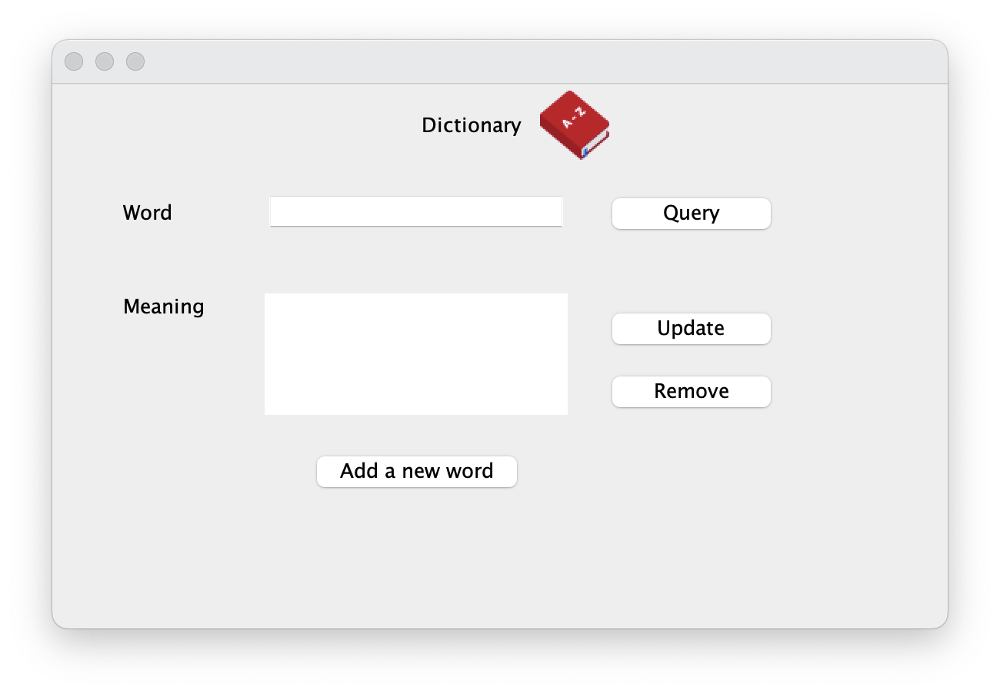
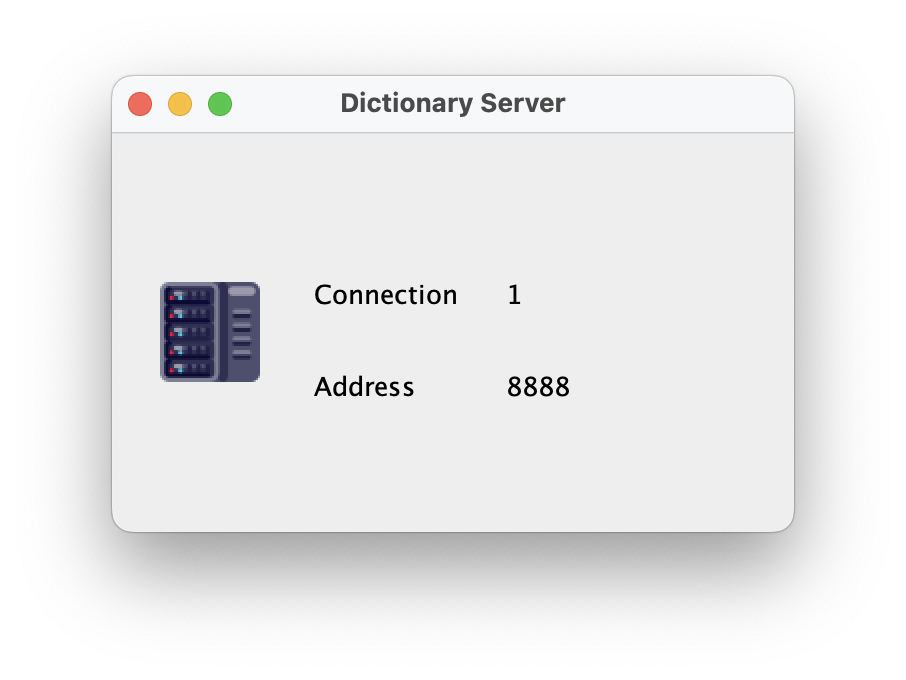

# COMP90015 Distributed system
Course resources COMP90015 - Distributed System - 2023 Semester 1

## How to run assignment 1 - multi-threaded-Dictionary-server

1. Change working directory to file path  
```cd location_you_downloaded_file/comp90015/asgmt1/submit```
2. Run server  
```java –jar DictionaryServer.jar <port> <file_name.txt>```  
eg: ```java -jar DictionaryServer.jar 8888 dictionary.txt```
3. Run client  
```java –jar DictionaryClient.jar <server-address> <server-port>```  
eg: ```java -jar DictionaryClient.jar localhost 8888```





